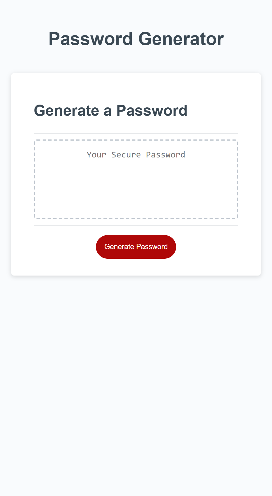

# Random Password Generator

## Description

This website will allow you to generate a secure password based on your desired character's and length

- For this project I was given starter code for HTML and CSS

- I learned how to use different windows prompts in JS

- I learned how to store values produced from a for loop as an array in a variable and how to return that array based on a set character limit using .slice in JS

## Usage

To use this website click "Generate Password" and select your desired character length based on the parameters, then select "ok" to include the prompted charcter types or "cancel" to not include them.

## Website Screenshot

[Git-Pages-Link](https://nolenhowe.github.io/password-gen/)
